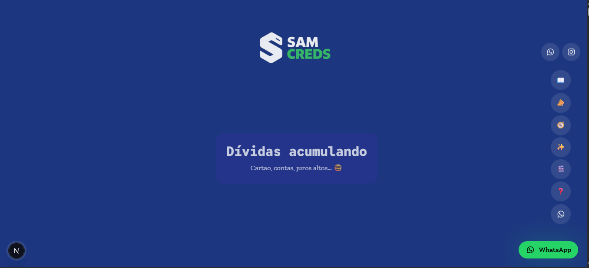
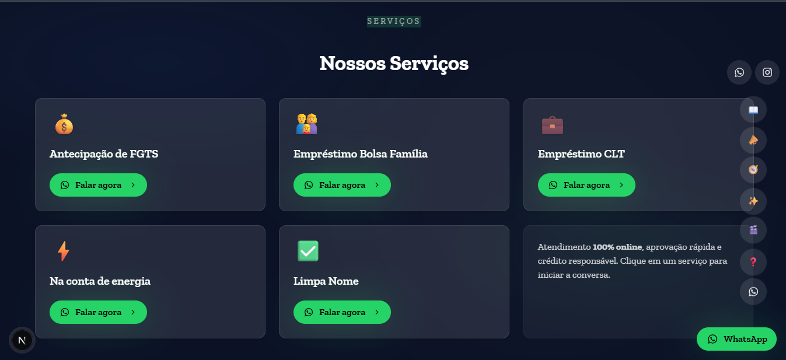
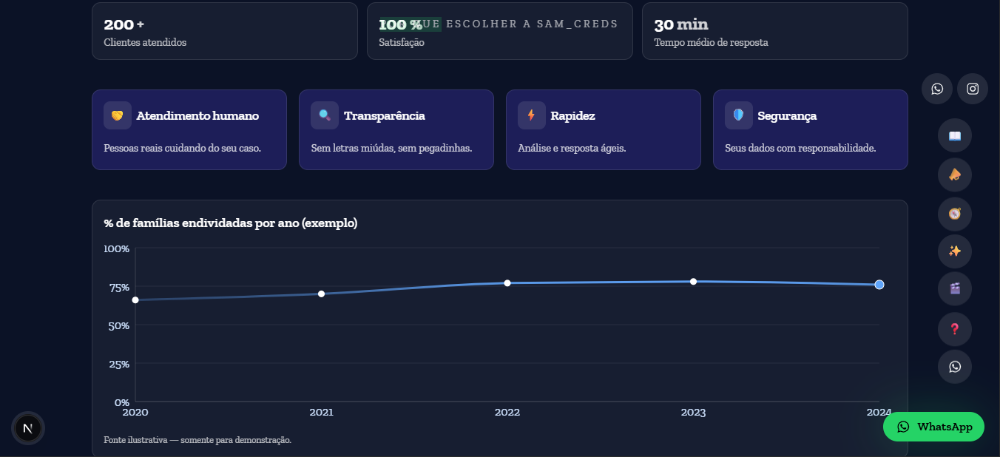
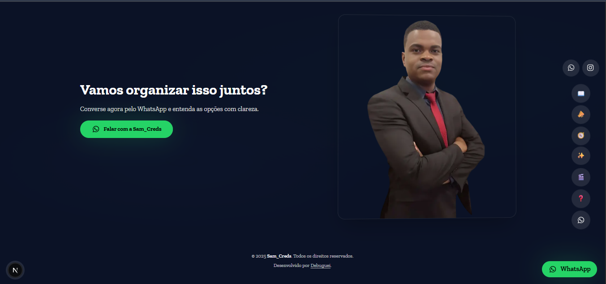
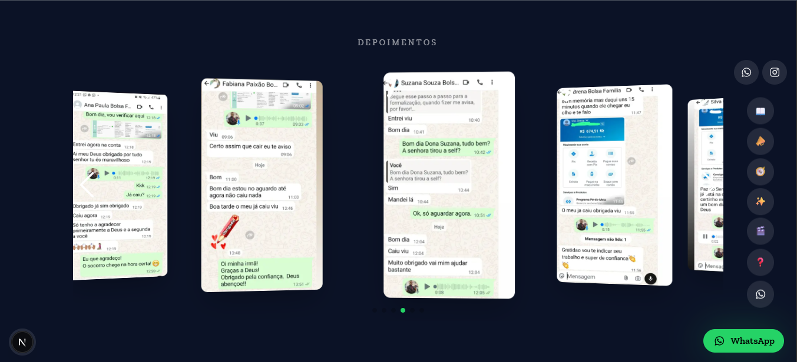

# 💰 Sam_Creds — Soluções Financeiras

Landing page cinematográfica e responsiva, desenvolvida para apresentar os serviços financeiros da **Sam_Creds**, especializada em **antecipação de FGTS**, **empréstimos consignados** e **soluções personalizadas** de crédito.

---

## 🧭 Visão Geral

O projeto foi desenvolvido como uma **landing moderna e interativa**, com foco total em:
- Experiência visual cinematográfica (GSAP + Swiper);
- Conversão direta via **WhatsApp**;
- Interface clara e confiável;
- Design escuro, elegante e profissional, reforçando autoridade e segurança.

---

## 🧩 Estrutura do Projeto


        📦 samcreds
        ┣ 📂 app
        ┃ ┣ layout.tsx
        ┃ ┣ page.tsx
        ┃ ┣ sitemap.ts
        ┃ ┣ robots.ts
        ┃ ┗ globals.css
        ┣ 📂 components
        ┃ ┣ 📂 sections
        ┃ ┃ ┣ Intro.tsx
        ┃ ┃ ┣ StoryScroll.tsx
        ┃ ┃ ┣ HeroSamuel.tsx
        ┃ ┃ ┣ Services.tsx
        ┃ ┃ ┣ WhyUs.tsx
        ┃ ┃ ┣ Testimonials.tsx
        ┃ ┃ ┣ FAQ.tsx
        ┃ ┃ ┣ FinalCTA.tsx
        ┃ ┃ ┣ Footer.tsx
        ┃ ┃ ┣ FloatingNav.tsx
        ┃ ┃ ┣ WhatsAppFab.tsx
        ┃ ┃ ┗ GoHomeFab.tsx
        ┃ ┣ 📂 ui
        ┃ ┃ ┣ button.tsx
        ┃ ┃ ┣ card.tsx
        ┃ ┃ ┣ accordion.tsx
        ┃ ┃ ┗ popover.tsx
        ┃ ┗ ScrollReset.tsx
        ┣ 📂 lib
        ┃ ┣ gsapClient.ts
        ┃ ┣ utils.ts
        ┃ ┗ usePrefersReducedMotion.ts
        ┣ 📂 public
        ┃ ┣ 📂 assets
        ┃ ┃ ┣ logo.png
        ┃ ┃ ┣ favicon.ico
        ┃ ┃ ┣ Samuel.png
        ┃ ┃ ┣ og.jpg
        ┃ ┃ ┣ site.webmanifest
        ┃ ┃ ┣ robots.txt
        ┃ ┃ ┗ sitemap.xml
        ┣ .gitignore
        ┣ package.json
        ┣ README.md
        ┗ tailwind.config.js

---

## 🎬 Destaques do Projeto

### ✨ Página Inicial (`Intro.tsx`)
- Animação cinematográfica com **GSAP** e **ScrollTrigger**;  
- Frases com transições suaves e efeito de profundidade;  
- Chamada para ação direta com botão **“Falar com a Sam_Creds”**.

### 💼 Seções Principais
- **StoryScroll** — narrativa animada sobre o problema e a solução.  
- **HeroSamuel** — destaque profissional com foto e CTA.  
- **Services** — cards detalhados com ícones e descrições.  
- **WhyUs** — motivos visuais e interativos com gráfico dinâmico.  
- **Testimonials** — depoimentos animados e realistas.  
- **FAQ** — seção cinemática com perguntas e respostas progressivas.  
- **FinalCTA** — chamada final para conversão via WhatsApp.

### 🧭 Navegação
- **FloatingNav** com ícones animados laterais.  
- **GoHomeFab** para retorno rápido ao início.  
- **ScrollReset** garante que o site sempre abra na primeira seção.

### 🦸‍♂️ Desenvolvido por
**Debuguei — Criação de Landing Pages cinematográficas e de alta conversão.**

---

## 🧠 Tecnologias Utilizadas

| Tecnologia | Função |
|-------------|--------|
| **Next.js 14 (App Router)** | Framework React moderno e performático |
| **TypeScript** | Tipagem estática e segurança no desenvolvimento |
| **TailwindCSS** | Estilização rápida e responsiva |
| **GSAP + ScrollTrigger** | Animações cinematográficas e interativas |
| **Swiper.js** | Carrossel de depoimentos fluido |
| **Lucide Icons** | Ícones vetoriais leves e modernos |
| **Font Awesome** | Ícones adicionais globais |
| **Vercel** | Hospedagem e deploy contínuo |

---

## ⚙️ Configurações de SEO

✅ **Sitemap e Robots configurados** (`/sitemap.xml`, `/robots.txt`)  
✅ **OpenGraph (og:image, título, descrição)**  
✅ **Manifesto PWA (`site.webmanifest`)**  
✅ **Favicon e ícone para dispositivos móveis**  
✅ **Título dinâmico via `metadata` no layout.tsx**

---

## 🚀 Como Rodar o Projeto

```bash
# Instalar dependências
npm install

# Rodar localmente
npm run dev

# Build de produção
npm run build
npm start
```

> O projeto rodará por padrão em:  
> 🌐 **http://localhost:3000**

---

## ☁️ Deploy na Vercel

1. Faça login em [vercel.com](https://vercel.com/).  
2. Conecte o repositório do GitHub com este projeto.  
3. Deploy automático será iniciado.  
4. Direcione o subdomínio:  
   ```
   samcreds.debuguei.com.br → [projeto na Vercel]
   ```
5. Adicione as variáveis de ambiente no painel da Vercel, se houver.

---

## 📸 Pré-visualizações

### 💻 Versão Desktop
| Página | Preview |
|--------|----------|
| **Home / História** |  |
| **Serviços** |  |
| **Por que escolher** |  |
| **Chamada / Final CTA** |  |
| **FAQ** |  |
| **Depoimentos** |  |

---

### 📱 Versão Mobile
| Página | Preview |
|--------|----------|
| **Home / História** |  |
| **Serviços** |  |
| **Por que escolher** |  |
| **Chamada / Final CTA** |  |
| **FAQ** |  |
| **Depoimentos** |  |

> 💡 **Nota:** As capturas da versão mobile são verticais (prints diretos do celular), enquanto as do desktop são horizontais, simulando a experiência completa no navegador.

---

## 🧾 Créditos e Licença

Criado com 💚 por **Debuguei**  
Todos os direitos reservados © 2025 — **Sam_Creds**.  
💼 *Landing cinematográfica de soluções financeiras.*
